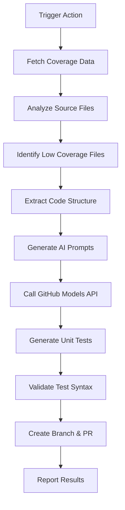

# GUTAI 🤖🧪

_Github Unit Test powered by AI_

A GitHub Action that automatically identifies files with low test coverage and generates comprehensive unit tests using AI. Boost your project's test coverage effortlessly with the power of GitHub Models!

[](https://github.com/marketplace/actions/gutai)
[](https://github.com/your-org/gutai/actions)
[](https://opensource.org/licenses/MIT)

## 🚀 Features

- **🔍 Smart Coverage Analysis**: Automatically fetches and analyzes test coverage from Codecov
- **🤖 AI-Powered Test Generation**: Uses GitHub Models to generate comprehensive, context-aware unit tests
- **📝 Smart PR Creation**: Auto-generates meaningful PR titles and commit messages based on code analysis
- **🎯 Intelligent Targeting**: Identifies and prioritizes files with the lowest test coverage
- **🌍 Multi-Language Support**: Works with Python, JavaScript, TypeScript, Java, C++, C#, Go, Rust, Ruby, PHP
- **📦 Zero Configuration**: Works out of the box with sensible defaults
- **🔄 Flexible Integration**: Use as a standalone action or integrate into existing workflows
- **📊 Detailed Reporting**: Provides comprehensive coverage analysis and test generation reports

## 📋 Quick Start

Add this action to your workflow:

```yaml
name: Boost Test Coverage
on:
  schedule:
    - cron: "0 2 * * 0" # Weekly on Sundays
  workflow_dispatch:

jobs:
  boost-coverage:
    runs-on: ubuntu-latest
    steps:
      - name: Boost Test Coverage with GUTAI
        uses: your-org/gutai@v1
        with:
          codecov-token: ${{ secrets.CODECOV_TOKEN }}
          github-token: ${{ secrets.GITHUB_TOKEN }}
          max-files: 3
          target-coverage: 80
          create-pr: true
```

That's it! The action will:

1. 📊 Analyze your code coverage
2. 🎯 Identify files with low coverage
3. 🤖 Generate comprehensive unit tests using AI
4. 🔄 Create a pull request with the new tests

## 🛠️ Inputs

| Input              | Description                                                        | Required | Default               |
| ------------------ | ------------------------------------------------------------------ | -------- | --------------------- |
| `codecov-token`    | Codecov API token for fetching coverage data                       | No       | `''`                  |
| `github-token`     | GitHub token for API access and PR creation                        | Yes      | `${{ github.token }}` |
| `max-files`        | Maximum number of files to process                                 | No       | `3`                   |
| `target-coverage`  | Only process files below this coverage %                           | No       | `80`                  |
| `languages`        | Comma-separated list of languages to include                       | No       | `auto-detect`         |
| `exclude-patterns` | Comma-separated glob patterns to exclude                           | No       | `test*,spec*,*_test*` |
| `test-framework`   | Preferred test framework (auto-detected if not specified)          | No       | `auto`                |
| `create-pr`        | Whether to create a pull request with generated tests              | No       | `true`                |
| `pr-title`         | Custom title for the pull request (auto-generated if not provided) | No       | `auto-generated`      |
| `branch-prefix`    | Prefix for the branch name                                         | No       | `coverage-boost`      |
| `ai-model`         | GitHub Models AI model to use                                      | No       | `openai/gpt-4.1-mini` |
| `output-format`    | Output format for test generation report                           | No       | `json`                |

## 📤 Outputs

| Output            | Description                                  |
| ----------------- | -------------------------------------------- |
| `files-processed` | Number of files that were processed          |
| `tests-generated` | Number of test files generated               |
| `coverage-report` | JSON report of coverage analysis             |
| `pr-url`          | URL of the created pull request (if created) |
| `branch-name`     | Name of the branch created with tests        |

## 📚 Usage Examples

### Basic Usage (Minimal Setup)

```yaml
- name: Boost Test Coverage
  uses: your-org/gutai@v1
  with:
    github-token: ${{ secrets.GITHUB_TOKEN }}
```

### Advanced Configuration

```yaml
- name: Advanced Coverage Boost
  uses: your-org/gutai@v1
  with:
    codecov-token: ${{ secrets.CODECOV_TOKEN }}
    github-token: ${{ secrets.GITHUB_TOKEN }}
    max-files: 5
    target-coverage: 75
    languages: "python,javascript,typescript"
    exclude-patterns: "migrations/*,vendor/*,node_modules/*"
    test-framework: "pytest"
    ai-model: "openai/gpt-4.1-mini"
    pr-title: "Improve test coverage for core modules"
    branch-prefix: "coverage-improvement"
```

### Integration with Existing Workflow

```yaml
name: CI/CD Pipeline
on: [push, pull_request]

jobs:
  test:
    runs-on: ubuntu-latest
    steps:
      - uses: actions/checkout@v4
      - name: Run tests
        run: npm test

      - name: Upload coverage to Codecov
        uses: codecov/codecov-action@v3
        with:
          file: ./coverage/lcov.info

  boost-coverage:
    needs: test
    if: github.event_name == 'push' && github.ref == 'refs/heads/main'
    runs-on: ubuntu-latest
    steps:
      - name: Boost Test Coverage
        uses: your-org/gutai@v1
        with:
          github-token: ${{ secrets.GITHUB_TOKEN }}
          max-files: 2
```

### Scheduled Coverage Improvement

```yaml
name: Weekly Coverage Boost
on:
  schedule:
    - cron: "0 9 * * 1" # Every Monday at 9 AM

jobs:
  weekly-coverage-boost:
    runs-on: ubuntu-latest
    steps:
      - name: Boost Test Coverage
        uses: your-org/gutai@v1
        with:
          codecov-token: ${{ secrets.CODECOV_TOKEN }}
          github-token: ${{ secrets.GITHUB_TOKEN }}
          max-files: 10
          target-coverage: 85
          pr-title: "Weekly test coverage improvements - {{date}}"
```

## 🎯 Supported Languages & Frameworks

| Language       | Test Frameworks      | Coverage Tools          |
| -------------- | -------------------- | ----------------------- |
| **Python**     | pytest, unittest     | coverage.py, pytest-cov |
| **JavaScript** | Jest, Mocha, Jasmine | Jest, nyc, c8           |
| **TypeScript** | Jest, Mocha, Vitest  | Jest, nyc, c8           |
| **Java**       | JUnit, TestNG        | JaCoCo, Cobertura       |
| **C#**         | NUnit, xUnit, MSTest | coverlet, dotCover      |
| **Go**         | testing (built-in)   | go test -cover          |
| **Rust**       | cargo test           | tarpaulin, grcov        |
| **Ruby**       | RSpec, Minitest      | SimpleCov               |
| **PHP**        | PHPUnit              | PHPUnit, Xdebug         |

## 🔧 Prerequisites

### Required Setup

1. **Codecov Integration**: Your repository should upload coverage reports to [Codecov](https://codecov.io)
2. **GitHub Token**: The action needs a GitHub token with appropriate permissions
3. **Repository Permissions**: Enable "Read and write permissions" for GitHub Actions

### Optional Setup

- **Codecov Token**: For private repositories or better rate limits, add your Codecov token as a repository secret

## 📊 How It Works



### Step-by-Step Process

1. **📡 Coverage Analysis**: Fetches coverage data from Codecov API
2. **🔍 File Identification**: Identifies source files with coverage below the target threshold
3. **🧠 Code Analysis**: Analyzes code structure (functions, classes, methods)
4. **🤖 Test Generation**: Uses GitHub Models via Azure AI Inference SDK to generate comprehensive test cases with contextually appropriate PR titles and commit messages
5. **✅ Validation**: Validates generated tests for syntax and basic structure
6. **🔄 Integration**: Creates a new branch and pull request with meaningful, auto-generated descriptions
7. **📋 Reporting**: Provides detailed reports on the coverage improvement process

## 🎨 Generated Content Quality

The action generates high-quality tests and meaningful commit messages that include:

### Generated Tests

- **✅ Happy Path Testing**: Normal use cases and expected scenarios
- **🚨 Error Handling**: Exception cases and error conditions
- **🎯 Edge Cases**: Boundary values and corner cases
- **🔒 Input Validation**: Testing with invalid or unexpected inputs
- **🎭 Mocking**: Appropriate mocking of external dependencies
- **📝 Documentation**: Clear test names and documentation
- **🧪 Best Practices**: Following language-specific testing conventions

### Auto-Generated PR Titles & Commit Messages

- **📝 Context-Aware**: Analyzes the codebase to create relevant titles
- **🎯 Descriptive**: Clearly describes what functionality is being tested
- **📊 Data-Driven**: Includes coverage statistics and file information
- **🏷️ Professional**: Uses conventional commit style and clear language
- **🔄 Dynamic**: Adapts to the specific files and functions being tested

Example auto-generated content:

- **PR Title**: "Add comprehensive tests for user authentication module"
- **Commit Message**: "test: enhance coverage for auth utilities and validation functions"

### Example Generated Test (Python)

```python
import pytest
from unittest.mock import Mock, patch
from myproject.calculator import Calculator

class TestCalculator:

    def test_add_positive_numbers(self):
        """Test addition with positive numbers."""
        calc = Calculator()
        result = calc.add(5, 3)
        assert result == 8

    def test_add_negative_numbers(self):
        """Test addition with negative numbers."""
        calc = Calculator()
        result = calc.add(-5, -3)
        assert result == -8

    def test_divide_by_zero_raises_exception(self):
        """Test that division by zero raises appropriate exception."""
        calc = Calculator()
        with pytest.raises(ValueError, match="Division by zero"):
            calc.divide(10, 0)

    @pytest.mark.parametrize("a,b,expected", [
        (0, 5, 5),
        (10, 0, 10),
        (-1, 1, 0),
        (100, -50, 50)
    ])
    def test_add_edge_cases(self, a, b, expected):
        """Test addition with various edge cases."""
        calc = Calculator()
        assert calc.add(a, b) == expected
```

## 🛡️ Security & Privacy

- **🔒 Secure**: Uses official GitHub APIs with proper authentication
- **🕵️ Private**: Code analysis happens in your GitHub Actions runner
- **🚫 No Data Storage**: No source code is stored or transmitted to third parties
- **✅ Audit Trail**: All operations are logged in GitHub Actions
- **🔐 Token Scope**: Requires minimal permissions (contents:write, pull-requests:write)

## 🐛 Troubleshooting

### Common Issues

<details>
<summary><strong>❌ "No coverage data found"</strong></summary>

**Possible causes:**

- Repository doesn't upload coverage to Codecov
- Incorrect Codecov token
- Branch name mismatch

**Solutions:**

1. Verify coverage upload in your CI/CD pipeline
2. Check Codecov integration at https://app.codecov.io/gh/your-org/your-repo
3. Add `CODECOV_TOKEN` secret for private repos
</details>

<details>
<summary><strong>❌ "GitHub Models API error"</strong></summary>

**Possible causes:**

- Invalid GitHub token
- GitHub Models not available in your region
- Rate limiting

**Solutions:**

1. Verify `github-token` has correct permissions
2. Check GitHub Models availability
3. Use `gpt-4o-mini` for better rate limits
</details>

<details>
<summary><strong>❌ "Generated tests don't compile"</strong></summary>

**Possible causes:**

- Complex code structure
- Missing imports or dependencies
- Framework-specific conventions

**Solutions:**

1. Review and adjust generated tests manually
2. Specify `test-framework` input explicitly
3. Use `exclude-patterns` to skip complex files
</details>

### Debug Mode

Enable debug logging by setting `ACTIONS_STEP_DEBUG: true` in your workflow:

```yaml
env:
  ACTIONS_STEP_DEBUG: true
steps:
  - name: Boost Test Coverage (Debug)
    uses: your-org/gutai@v1
    # ... inputs
```

## 🤝 Contributing

We welcome contributions! Please see our [Contributing Guide](CONTRIBUTING.md) for details.

### Development Setup

```bash
git clone https://github.com/your-org/gutai
cd gutai
npm install
npm test
```

### Testing

```bash
# Run unit tests
npm test

# Test with example repository
npm run test:integration

# Lint and format
npm run lint
npm run format
```

## 🧪 End-to-End Testing

GUTAI includes a comprehensive E2E test that validates the complete workflow:

```bash
# Run the full E2E test
python3 test_e2e.py

# Or use the convenience script
./run_e2e_test.sh

# With real GitHub Models integration
export GITHUB_TOKEN="your_token"
python3 test_e2e.py
```

The E2E test:

1. 📊 Runs pytest with coverage on sample code
2. 🔍 Identifies the least covered file
3. 🤖 Generates new tests using GitHub Models
4. ✅ Applies tests and validates they pass
5. 📈 Reports coverage improvement

See [E2E Testing Guide](docs/e2e-testing.md) for detailed information.

## 📄 License

This project is licensed under the MIT License - see the [LICENSE](LICENSE) file for details.

## 🙏 Acknowledgments

- [GitHub Models](https://github.com/marketplace/models-github) for AI-powered test generation
- [Codecov](https://codecov.io/) for coverage analysis
- [GitHub Actions](https://github.com/features/actions) for automation platform
- The open-source community for inspiration and feedback

## 📞 Support

- 📖 [Documentation](https://github.com/your-org/gutai/wiki)
- 🐛 [Issues](https://github.com/your-org/gutai/issues)
- 💬 [Discussions](https://github.com/your-org/gutai/discussions)
- 📧 [Email Support](mailto:support@yourorg.com)

---

<div align="center">

**Made with ❤️ for the developer community**

⭐ Star this repo if it helped you boost your test coverage!

[Report Bug](https://github.com/your-org/gutai/issues) • [Request Feature](https://github.com/your-org/gutai/issues) • [Documentation](https://github.com/your-org/gutai/wiki)

</div>
